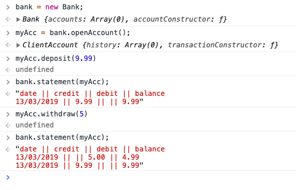

This is a practice tech test in Makers course week 10. If you came here looking for the solution... why are you doing that? You won't learn by copying.

The instructions were [here](https://github.com/makersacademy/course/blob/master/individual_challenges/bank_tech_test.md).

I decided to use JavaScript, to revise after two weeks of Ruby, and the Jasmine testing framework since I wasn't going to be using a browser (REPL interface, so Node.js runtime environment). I decided to follow the [Google JavaScript Style Guide](https://google.github.io/styleguide/javascriptguide.xml), checking this with the [associated ESLint config](https://github.com/google/eslint-config-google).

## Usage

This was specified as a command line or console app.

```bash
> git clone https://github.com/david-mears/bank-tech-test.git
> cd bank-tech-test
> npm install
> open SpecRunner.html
```

Then open the developer console.



## Plan

My original plan was as follows:

### Transaction

- two data points (variables) for each transaction: change (+/-) in balance, and date.

### ClientAccount

- contains account history in an array of transactions
- (public interface) mutating functions: deposit, withdraw (which both create transactions)
- (public interface) processing functions: balance

### Bank

- contains array of accounts
- functions: displaying info about accounts

Later addition:

### Statement

When I saw that Bank was a long class - over 50 lines - that flagged that I had given it too many responsibilities. I decided to extract Bank's display functionality to a separate class, Statement.

This in turn revealed that the remaining functionality on Bank - the ability to create an account and contain a list of accounts - is not actually from the requirements. I don't need the Bank constructor function at all. Or rather, instead of extracting the display functionality from Bank, it would have been quicker to just remove the account listing and creating functions.
